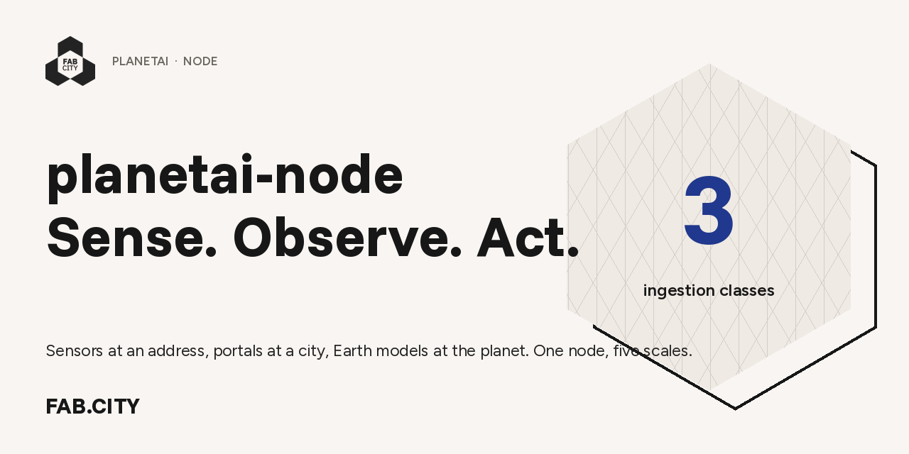

<p align="center">
  
</p>

<p align="center">
  <a href="LICENSE"></a>
  <a href="CHANGELOG.md"></a>
  
  
  
  <a href="https://planetai.fab.city/node0/"></a>
</p>

# planetai-node

**A node is the smallest unit of a distributed computer for places.** It observes where it stands, decides locally,
tells the people there what to do, and sends upward only what it chooses to. Your readings stay on your machine.
What travels is hourly means, [Fab City Index](https://index.fab.city) cells, and the one number nobody else measures:
whether an observation ever became an action.

The core is domain-blind and scale-blind: it knows about readings, rules and cells — not about air, and not only
about the address it sits at. Three ingestion classes ship. **Sensors** (Smart Citizen, AirGradient, PurpleAir) for the
Community scale. **Portals** — one `ckan` adapter reads Barcelona's, Boston's, Santiago's and Bali's open-data
portals — for City and Region. **Models** — `openmeteo` samples a global forecast at any coordinates on earth — for
Planet boundary conditions. Node #1 measures air because a sensor was on the wall; the next domain is a folder, not a
fork ([`DOMAINS.md`](docs/DOMAINS.md)), and the next scale is an adapter ([`COVERAGE.md`](docs/COVERAGE.md)).

```bash
curl -fsSL planetai.fab.city/install | bash
```

That is the whole install. It fetches the code, then asks three things: a name for the node, where it is (type a
place; it finds the coordinates and time zone), and whether you have a sensor. Everything else is detected or
defaulted. One to three minutes later the node is running, and one command each connects your phone and fires a
test alert so you see the whole path:

```bash
planetai telegram
planetai test-alert
```

**A node needs coordinates, not hardware.** On first start it pulls 92 days of Copernicus CAMS air-quality history
and 40+ years of NASA POWER satellite climatology for its location — free, no key, anywhere on earth — so it has
something true to say from the first minute. Add a sensor when you have one; the interesting number is then the
*gap* between your reading and the global model, which is the local signal a 11 km grid cell cannot see.
([`docs/PREFILL.md`](docs/PREFILL.md))

Prefer flags to a form? The installer underneath takes them directly:

```bash
./install.sh --preset bali --name bayu-2 --sc 19880                      # node #1
./install.sh --name mayur-vihar --lat 28.6139 --lon 77.2090 --no-bad     # anywhere, no sensor
```

Two containers by default — Postgres and one Python service, about 1,400 lines. (A broker for Meshtastic and
Home Assistant, and a Reticulum bridge, are optional profiles, off unless you turn them on.) Runs on a Mac (Apple Silicon or Intel), any Linux
box, a Raspberry Pi 4/5, or Windows via WSL2. Reads **Smart Citizen** (cloud API), **AirGradient** and **PurpleAir**
(both directly over your WiFi, no cloud), alone or mixed. First reading in five minutes. First alert when the air earns one.

A node works anywhere: it needs coordinates, a computer that stays on, and optionally a sensor. Four sites ship as
presets (`bali`, `barcelona`, `boston`, `santiago`, plus `delhi` as a non-pilot example); anywhere else takes
`--lat --lon`. What "outside" means is resolved per site: nearby public sensors where a network has them, and the
global CAMS model everywhere else.

> **Node #1** is *"Bayu 2, Indoor"*, Smart Citizen Kit 19880, Kuta Selatan, Bali, live since 2 September 2026 on a Mac
> already in the room. It is the worked example throughout the docs, not a requirement.
> → [planetai.fab.city/node0](https://planetai.fab.city/node0/)

---

## Never run a server? Start here.

**[`docs/START_HERE.md`](docs/START_HERE.md)** walks the first install end to end — requirements, four pre-flight checks,
install, Telegram, a forced test alert, closing the loop, and what to do when something breaks — for someone who has never
opened Terminal. It was written against the real first install and fixed for every failure it hit.

Not on a Mac? **[`docs/PLATFORMS.md`](docs/PLATFORMS.md)** — Linux, Raspberry Pi, Windows (WSL2), Intel Mac: only what differs.
Leaving it in a cupboard? **[`docs/MAC_MINI.md`](docs/MAC_MINI.md)** — the settings that bring it back after a power cut.

## What it does

| | |
|---|---|
| **Sense** | Any metric, any scale, any source. Sensor, portal and model adapters: Smart Citizen by kit number; AirGradient and PurpleAir straight off the LAN (EPA 2021 humidity correction applied, raw stored beside corrected); Bali Air Dispatch as the public ambient reference in Bali. Adding a source is one function — [`docs/sensors.md`](docs/sensors.md). |
| **Observe** | Postgres on the node. Hourly means. A read API every node exposes identically: `/sensors /readings /stats /aggregates /alerts /cells /rho`. Indoor flagged, stale dropped, gaps left as gaps. |
| **Act** | Rules are SQL. Two domain-blind rules ship in [`config/rules.yml`](config/rules.yml) (dead sensor, daily pulse); the air decisions — shut the windows, ventilate — live in [`packs/air-quality/`](packs/air-quality). When a rule is true, one message goes out in the local language. |
| **Index** | Packs declare which cell their SQL feeds; the core evaluates it and polices the provenance. `Governance` is filled at every node in every domain, because ρ comes from the actions ledger. `GET /cells` emits [`fci-cells-v0`](https://index.fab.city) rows the node can honestly compute, each carrying `live \| partial \| mock`. `POST /actions` records that a human acted — that's **ρ**, the Index's action-latency term, measured for the first time by node #1: **0.33**. |

The whole building — three layers, five scales, contracts, how compute attaches downstream (phones) and upstream
(clusters, frontier models), and what comes back when it's earned — is drawn once in **[`ARCHITECTURE.md`](ARCHITECTURE.md)**.
This repo is Stage 0.

## Updating

```bash
./update.sh          # backs up, pulls, migrates the live database, rebuilds, verifies
```

Postgres only runs `init.sql` when the data volume is created, so a running node needs the schema applied to it —
that's what `update.sh` does, from the same idempotent file. Schema changes are additive only, so rolling back is
`git checkout <tag> && docker compose up -d --build`. Full detail, including backfilling history onto an older node:
[`docs/UPDATING.md`](docs/UPDATING.md).

## Day one

```bash
planetai status        # alive? what has it read, what fired, what is rho
planetai doctor        # every check, with the fix named next to any failure
planetai sensors       # yours vs reference, indoor vs outdoor
planetai cells         # what this node reports to the Index
planetai logs
```

The `make` targets remain for developers; operators never need them.

Close the loop on an alert, which is how ρ gets measured:

```bash
planetai act 3 "closed windows"
```

## Repository

```
install             the front door: curl | bash. gets git, gets the code, runs planetai setup
bin/planetai        the operator's one command: setup · status · doctor · telegram · test-alert · act · update
install.sh          the engine underneath: platform detect → docker → .env → up → doctor → nightly backup cron
docker-compose.yml  db (postgres:16) + app
app/main.py         poll sources → postgres · rules (SQL) → telegram · hourly push · http
app/sources.py      smartcitizen · airgradient · purpleair · baliairdispatch · epa_2021_correct()
app/index.py        fci-cells-v0 cells + ρ from the actions ledger
config/rules.yml    domain-blind core rules (dead sensor, daily pulse). reloads within a minute
packs/air-quality/      domain pack: PM2.5 rules + cells (Environmental|Community, |City)
packs/open-data-health/ scale pack: CKAN portal maintenance → Governance|City
packs/cold-start/       day-one value with zero hardware: modelled air, normals, sensor-vs-model gap
packs/insight/          a digest every 3h; daily: how indoor, street and satellite agree, and the street's worst hour
packs/heat/             apparent temperature, heat-stress hours, nights that never cool → Social|Community
packs/coast/            waves, swell, sea temperature at the nearest ocean cell (code pack, key-free)
packs/earth-engine/     tree cover, built-up, NDVI, night lights, AlphaEarth change score around the node (code pack, needs a GEE account)
presets/                bali · barcelona · boston · santiago — coordinates, timezone, portal, language
app/bootstrap.py        first-run fill from CAMS + NASA POWER + a place name
init.sql            sensors · readings · alerts · actions; views readings_1h · stats
registry.json       the node directory. adding a node = a PR
update.sh           in-place update: backup → pull → migrate → rebuild → verify
backup.sh           nightly pg_dump, 14-day retention, point BACKUP_DIR at a NAS
tests/              offline adapter tests against saved payloads
packs/              community extensions — drop a folder here (docs/PACKS.md)
docs/               getting a node running   START_HERE · PLATFORMS · MAC_MINI · UPDATING
                    what it can tell you    USE_CASES · sensors · DOMAINS · COVERAGE · PREFILL
                    extending it            PACKS · PACK_IDEAS · DEVELOPING
                    radios and reachability NETWORKING · MESHTASTIC · MESHTASTIC_APP · MESHTASTIC_FLEET
ARCHITECTURE.md     the building
SPEC.md             this brick: contracts, and the retired pieces with their triggers
PRODUCT.md          who this is for and what they pay for
CHANGELOG.md        what changed and why
```

## Principles

1. **One alert someone acts on beats any dashboard.** If nothing here changes a decision at the address, the node is decoration.
2. **Nothing we can't run ourselves.** Postgres, Python, Docker. Public APIs we read are read-only and key-free. The chat app is the one outside dependency and it's a function, not a service.
3. **Raw stays local.** Readings live on this machine. Hourly means go up to a district node when one exists. Nothing else leaves.
4. **Inherit the honesty rules.** Indoor flagged. Stale dropped. Corrected values stored next to raw. Credit the network that measured. [Bali Air Dispatch](https://baliairdispatch.com/appendix) wrote these down; we follow them.
5. **Boring wins.** Novelty is spent on the alerts, nowhere else. The version before this one was 1,479 lines and twelve containers; see `SPEC.md §6` for what was cut and the condition under which each piece comes back.

## Extend it — packs

The core is small on purpose. Everything specific to a place belongs to whoever lives there. A **pack** is a folder in
`packs/` that adds a rule, an Index cell, or a sensor — and most useful packs contain no code at all.

```
packs/monsoon-bali/
  pack.yaml     id, author, version, requires: { node: ">=0.1.1" }
  rules.yml     SQL + message  — DATA, ids namespaced automatically
  cells.yml     SQL → an fci-cells-v0 row  — DATA
  adapter.py    a new sensor or feed — CODE, off until PACKS_ALLOW_CODE=1
```

Three tiers, three review bars: **core** here under tagged releases · **official packs** in `fabcity/planetai-packs`,
reviewed the same way but optional at install · **community packs** in your own repo, listed via PR to the marketplace
repo, verified or unverified and honest about which. Full model, and how to write one:
[`docs/PACKS.md`](docs/PACKS.md). A worked example ships at [`packs/example-cooking-hours/`](packs/example-cooking-hours).

## Developing

One machine develops, nodes only consume. `make dev-setup` installs a pre-commit hook that blocks secrets and runs
the offline gates; `make release V=x.y.z` lints, tests, tags, pushes and builds a clean tarball. Setting up a dev
machine, running a throwaway test node, and why nodes get `--push no-push`: [`docs/DEVELOPING.md`](docs/DEVELOPING.md).

## Contributing

Run a node, tell us what broke, send the fix. [`CONTRIBUTING.md`](CONTRIBUTING.md). Issues have two templates:
*Node problem* (asks for exactly the three commands we need) and *New sensor or data source*.

## Licence and credit

Code [Apache 2.0](LICENSE) · docs CC-BY 4.0 · hardware designs, when they exist, CERN-OHL-S.
Data from [Smart Citizen](https://smartcitizen.me) (Fab Lab Barcelona) and [Bali Air Dispatch](https://baliairdispatch.com) and
its upstream networks stays under their terms; attribution required — see [`NOTICE`](NOTICE).

A [Fab City](https://fab.city) research initiative · operated in Bali by Meaningful Design Group with Fab Lab Bali.
