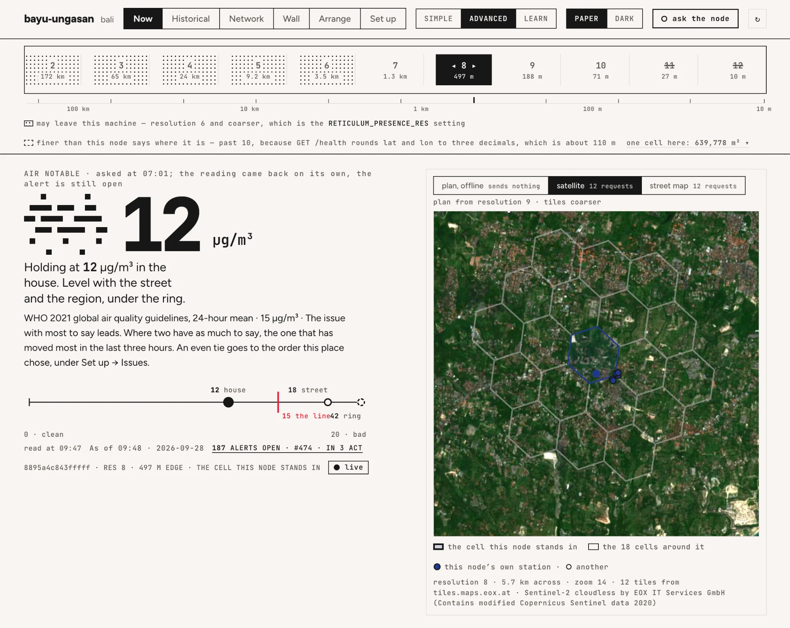

<p align="center">
  
</p>

<p align="center">
  <a href="LICENSE"></a>
  <a href="CHANGELOG.md"></a>
  
  
  
  <a href="https://planetai.fab.city/node0/"></a>
</p>

# planetai-node

**Hyperlocal compute and intelligence for distributed production.** A node is one computer per place, on
hardware the place already owns. It reads what measures that place, from a particle sensor on the wall to a satellite
overhead, tells the people there in plain sentences what to do about it, records what they did, and measures whether
it worked. Its purpose is fixed: clean air, water and soil for the people and the other living things around each
node. Raw readings stay on the machine; only summaries travel.

> **Beta.** `main` is the beta channel: every update is signed, and a node refuses one that does not verify. It is still
> an experiment, and installing a node makes you part of it: things will break, some will surprise you, and what you
> report decides what gets fixed first. Write to **info@fab.city** with what broke, what helped, what did not.

```bash
curl -fsSL planetai.fab.city/install | bash
```

Four questions, two minutes, running. Then `planetai telegram` for the alerts and `planetai ui` for the dashboard.
Walk-through in [`docs/START_HERE.md`](docs/START_HERE.md).

## What it is

Twenty years of fab labs and makerspaces built a distributed infrastructure for making things, and since 2014 the
cities of the Fab City pledge have committed to producing half of what they consume by 2054. What that
infrastructure never had is computing of its own: a machine at each place that reads the place, works out what it
needs, and says why it should be made there rather than shipped in. A node is that machine.

The rule it runs on is Fab City's rule for production, applied to data: DIDO, data in, data out. Raw readings stay on
the machine; only summaries travel, to a parent node if you name one, to the [Fab City Index](https://index.fab.city),
and to the models that need ground truth. Today a node reads air and heat from sensors, land and coast from public and
satellite sources; water and soil have no pack yet, and no node has handed a job to a workshop yet. Programme:
[planetai.fab.city](https://planetai.fab.city/) · documentation: [planetai.fab.city/docs](https://planetai.fab.city/docs/).

## What it does

- **Connects every scale.** Sensors on WiFi (Smart Citizen, and Xiaomi purifiers through a wild pack; the AirGradient and
  PurpleAir adapters are written and not polled in this version), radios over LoRa where there is no WiFi (Meshtastic),
  public stations nearby, the city's open-data portal, Copernicus atmosphere and ocean models, Earth Engine's view of the
  land. One schema from the house to the planet.
- **Turns awareness into action.** Alerts say what is happening, what it means, what to do. Then the node measures
  whether anything changed: ρ, the share of act-level alerts somebody answered, a number the Index never had.
- **Shows the place.** A dashboard that leads with whatever the node puts first, as a number and a sentence, then the day
  as an annotated chart, every source with a note, the sea, the land, the weather. Six views: Now, Historical, Network,
  Wall, Arrange, Set up. Simple mode answers three questions (is it fine, is anything changing, is there something to
  do); advanced draws everything; learn explains each mark. Paper or dark.
- **Answers questions.** Ask the node from the dashboard's pane, or from a bot on your Telegram. Both run a small model on
  your own machine by default, read the node and explain it; point them at a bigger model on your network when you have
  one. Every answer says which model gave it and where that model runs, and nothing goes online unless somebody here
  chooses it.
- **Keeps the data where it was made.** Local database, nightly backups a NAS can collect, an open daily export you decide
  where to send.
- **Grows by folders.** Air, heat, coast, land, place (what is around you, from OpenStreetMap, in PostGIS) and open-data packs ship. Water, energy, noise, classroom CO₂, fire smoke
  are a folder of rules each, written by whoever needs them, for their place.

Node #1, `bayu-ungasan`, has run in Kuta Selatan, Bali, since 2 September 2026 (above). Node #2 has run in Menorca since
10 September.

## Read next

The documentation site is **[planetai.fab.city/docs](https://planetai.fab.city/docs/)** — the same pages, with a
sidebar, search and the API reference, built from this repository by `tools/build_docs.py`. The files themselves:

```
docs/     getting a node running   START_HERE · PLATFORMS · REVIVE_A_LAPTOP · MAC_MINI · UPDATING · STORAGE · ARM64
          when it goes wrong       TROUBLESHOOTING
          what it can tell you     USE_CASES · sensors · DOMAINS · COVERAGE · PREFILL · GUI · MODELS
          radios and reachability  NETWORKING · MESHTASTIC
          extending it             PACKS · PACK_IDEAS · SOURCES · DEVELOPING
          testing a beta           BETA_TESTER_GUIDE · FAB26_EXPERIMENT
          releasing it             WORKFLOW · NEXT_RELEASE · SIGNING
          specs, each with status  SPEC_custody · SPEC_identity · SPEC_rho · SPEC_discovery · SPEC_decide · SPEC_alerts · SPEC_dashboard_events · SPEC_event_led_state · SPEC_dashboard_figures · SPEC_language · SPEC_journeys
          proposed, then decided   proposals/ · decisions/
          the documentation site   site/ (planetai.fab.city/docs)
          the page's design rounds design/ (not shipped to nodes)
          history                  archive/ (handoffs, reviews, plans: what was true then, not now)
SECURITY.md       reporting a vulnerability, and the key a node checks an update against
AGENTS.md         for an AI agent operating the node
ARCHITECTURE.md   how it is built; SPEC.md   what was left out and when it returns; PRODUCT.md   who pays for what
```

## Who runs this

One person maintains it today, with a second holding access and a proposed scope — `MAINTAINERS.md`.
`GOVERNANCE.md` says who has to agree to what, and why the installer and `init.sql` need two people.

## Bring your own agent

A node is a thing you operate, and most people who install one will do it with an agent beside them. This
repository is written for that: `AGENTS.md` opens with a table that routes an agent to one of eight skills
in `skills/`, and `make lint` fails if a skill names a command or a path that does not exist. Paste this
to your agent and nothing else:

> You are helping me with a PLANETAI node — an open-source program that turns a spare computer in my home
> or lab into a hyperlocal environmental monitor. Start by reading
> https://raw.githubusercontent.com/fabcity/planetai-node/main/AGENTS.md — its first section is a table
> that routes you to the right skill for what I am asking, and the rest of it is what you must not break.
> Read that skill before you tell me to run anything. Never ask me for the contents of my `.env` file, and
> never suggest exposing the node to the internet; the answer to reaching it from elsewhere is Tailscale.

`llms.txt` indexes every document here for an agent arriving from outside, and `.mcp.json` wires a clone of
this repository to a running node — the URL and the token come from your shell, so nothing secret is in the
file. `planetai agent` on the node prints the three facts you need for any other client.

## Layout

```
app/       main.py · sources.py · index.py · issues/ · packs.py · settings.py · ask.py · agent.py · agent_loop.py · report.py ·
           static/
bin/       planetai, the command line
packs/     air-quality · heat · insight · trust · cold-start · open-data-health · coast · earth-engine · earth · place ·
           nearby · season · forecast · make · thingdata · example-cooking-hours
config/    rules.yml · channels.yml · mosquitto · reticulum
tools/     the checks, hooks, bundle and release scripts, mesh-provision.sh, nas/, remote-model.sh
tests/     offline suites
presets/   bali · barcelona · boston · santiago · delhi · menorca
```

## Licence

Apache 2.0 today; AGPL-3.0-or-later once every contributor has consented
([docs/decisions/2026-09-25-licence.md](docs/decisions/2026-09-25-licence.md)). Fab City Foundation, 2026. Beta; feedback
to info@fab.city.
